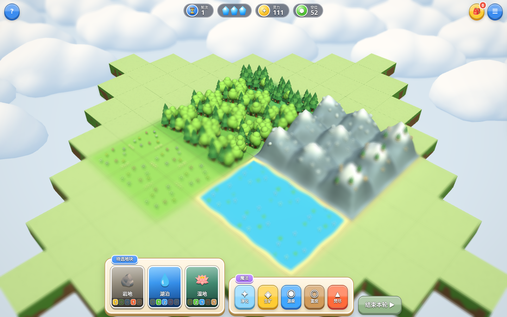

# 灵地复苏

五行地块回合制网页原型。使用 Three.js 绘制地图，规则引擎可独立在 Node.js 运行，无需构建或联网加载依赖。

[打开正式版](https://element-habitat.vercel.app) · [连片景观与上线验证](docs/CONNECTED-LANDSCAPE.md) · [验证记录与手机截图](docs/VALIDATION.md) · [Codex 云端开发配置](docs/CODEX-CLOUD.md)



每轮有 3 点行动，至少放置 1 块地块。放置地形、施放魔法、移动元素灵和动物、合成元素兽、使用结晶及制造物品，直到铺满 85 格地图。灵力由地块属性、元素灵、元素兽和元素动物共同计分。

使用普通和大型元素结晶不消耗行动点：分别使目标元素属性增加 1 和 2，仍消耗对应结晶库存。使用结晶不会自动换轮，最后 1 点行动仍可用于放置。

相容地貌按上下左右连接成片（森林／雨林、荒山／岩山、湖泊／湿地等）。山脉共享跨格山脊，湖岸沿整片湖泊的外围生成，溪流在相邻地块间接通，树群跨过内部边界。连片达到 **3／6／10 格**时，景观增加模型密度、分枝、地被和山体细节，并播放按距离扩散的成长波、连片提示与升阶音效；地块详情可查看当前连片数和下一档。景观装饰不参与资源、行动点或灵力计分。见 [连片景观开发说明](docs/CONNECTED-LANDSCAPE.md)。

## 本地运行

在项目根目录执行：

```sh
npm run dev
```

需要 Node.js 22+（推荐 24）与 Python 3.10+。也可直接运行 `python -m http.server 8080`。游戏不需要构建，npm 仅统一开发和测试命令。

打开 `http://localhost:8080`。桌面支持点击选择、拖拽旋转、滚轮缩放、右键平移；手机支持点击、双指缩放和平移。选中卡片后点击相邻空位放置；`Esc` 取消操作。

## 验证

```sh
npm ci
npm test
```

无头 Chromium 验证实际点击、触摸模拟、选框、收益飞行、计数结算、特效回收和手机布局：

```sh
python -m pip install -r requirements.txt
python -m playwright install chromium
python scripts/browser_check.py
```

默认使用 Playwright 自带 Chromium，设置 `PLAYWRIGHT_BROWSER_CHANNEL=msedge` 可使用本机 Edge。Linux/Codex 运行 `bash .codex/setup.sh` 一次完成系统库、Python 虚拟环境和浏览器安装；Windows 虚拟环境步骤见 [云端配置说明](docs/CODEX-CLOUD.md)。脚本自动启动本地服务器，并把截图和报告写入被 Git 忽略的 `artifacts/`。放置、收益和结晶飞行的中途帧检查使用 Playwright 虚拟时钟，避免慢速软件渲染错过动画；结算检查仍验证最终计数及节点清理。无头浏览器使用软件 WebGL，不能代表真实手机或 GPU 性能。

桌面与手机检查顺序运行，每组完成后关闭视口，避免多个软件渲染上下文竞争资源。

结晶免费使用的专项检查（覆盖普通及大型结晶、库存、属性、行动点、回合和 HUD）：

```sh
python scripts/crystal_check.py
python scripts/crystal_check.py --url https://gameplay-prototype.vercel.app --report crystal-check-production.json
```

泛光与景深的图像和交互检查需要 Pillow，用固定画面对比分别开启 Bloom 和景深后的结果：

```sh
python scripts/atmosphere_check.py
```

统一运行三组浏览器检查：`npm run test:browser`；规则与浏览器全部检查：`npm run test:all`。虚拟环境安装后 npm 命令会自动选择 `.venv`，无需激活。项目交接背景见 [接续开发说明](docs/PROJECT-CONTEXT.md)，云端 Codex 的工作约定见 [AGENTS.md](AGENTS.md)。

连片景观专项检查：`npm run test:landscape`，覆盖桌面／手机的连片升阶、山体拾取、成长反馈、满图森林、重建回收及减少动态效果偏好；截图和报告保存在 `artifacts/landscape-*`。

比较截图、聚焦与缩放验证见 [氛围效果说明](docs/ATMOSPHERE-2026-10-03.md)。

## 实现

| 文件 | 职责 |
| --- | --- |
| `data.js` | 地块、元素、生物、配方及规则参数 |
| `game.js` | 状态、行动、轮末产出、计分及表现事件 |
| `landscape.js` | 视觉地貌区域、外围距离场、山脊与连片升阶判定 |
| `view.js` | 连续地表、装饰、拾取、虚线框及分类型特效 |
| `postfx.js` | 高光泛光、深度景深、焦点跟随、轻暗角及画质分档 |
| `tokens.js` | 收益飞行、40 个 Token 上限、HUD 延迟计数、结晶落地 |
| `index.html` | 界面、交互、合成音效 |

地表使用统一世界坐标高度采样，跨格边界共享高度与颜色；格子轮廓保留细线。底座连续，侧壁埋入地面，树木与单位跟随表面高度。参考 [《文明 VI》画面](https://www.shacknews.com/article/94808/civilization-6-preview-a-tale-of-many-cities) 的地貌过渡，以及 [TerraScape](https://store.steampowered.com/app/2290000/TerraScape/) 的自然色调和植被群落。保留当前方格规则，材质纹理由程序生成。

地图外围参考《海岛奇兵》的云层遮盖方式，以及 [Toon Clouds Set](https://sketchfab.com/3d-models/toon-clouds-set-simple-lowpoly-81faaba6a78046d5a3e88597565079ab) 的圆润轮廓。云模型由程序生成：多个隆起平滑融合成完整云团，使用平滑法线、暖白顶面和浅蓝阴影，避免硬切面及球体穿插接缝。四种云型通过实例化网格组成云海，避开整个可操作地图，不再绘制外围绿地、山丘和树林。

模型使用明亮的卡通配色：草地与植被增强色彩，山体由主峰、侧峰、山脚和雪帽组成，树冠增加体积层次，岩石使用更多切面，水塘带不规则浅色岸线与细小波纹。

参考 [《林间小世界》](https://store.steampowered.com/app/2198150/Tiny_Glade/) 的微缩景观画面，增加柔和的高光 Bloom 和按真实场景深度计算的光圈景深。默认聚焦地图中心，选中地块或进入目标操作时焦点跟随；焦点附近保持清晰，近处和远处逐渐虚化。轻暗角收束画面，DOM 界面、文字与收益 Token 不经过模糊处理。菜单中的“氛围开 / 关”可切换并保存偏好。

特效使用尘雾、水滴、碎片和火星的不同形状，随生命周期透明消散；桌面使用固定临时灯池和短拖尾，手机模拟质量禁用这两项、粒子数量减半。减少大面积光环和强闪白。视觉效果仍需要在预览中人工确认。

## 部署

已关联 Vercel 项目时运行：

```sh
vercel deploy --target preview --yes
```

上面的命令只创建预览。发布正式版运行 `vercel deploy --prod --yes`。当前正式版包含连续地形、卡通云海与结晶免费使用规则。

Vercel 会验证提交作者，请使用部署账号关联的邮箱署名提交。此次正式上线与专项复测见 [发布记录](docs/RELEASE-2026-10-02.md)。

[GitHub Actions 示例](docs/ci-example.yml) 可做规则与地形检查，不触发部署；当前 GitHub 登录令牌缺少 `workflow` 权限，因此暂未启用自动检查。获得该权限后可把示例移到 `.github/workflows/check.yml`。

此原型没有账号系统或对局存档。刷新页面会开始新对局；音效偏好使用浏览器本地存储。Three.js 授权见 [第三方声明](THIRD_PARTY_NOTICES.md)。
