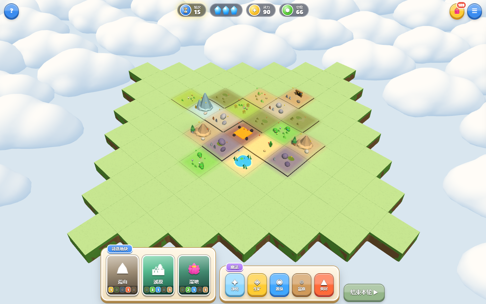

# 灵地复苏

五行地块回合制网页原型。使用 Three.js 绘制地图，规则引擎可独立在 Node.js 运行，无需构建或联网加载依赖。

[打开本次预览](https://gameplay-prototype-d9qbub3eh-wangshuq20041122-4927s-projects.vercel.app) · [验证记录与手机截图](docs/VALIDATION.md)



每轮有 3 点行动，至少放置 1 块地块。放置地形、施放魔法、移动元素灵和动物、合成元素兽、使用结晶及制造物品，直到铺满 85 格地图。灵力由地块属性、元素灵、元素兽和元素动物共同计分。

## 本地运行

在项目根目录执行：

```sh
python -m http.server 8080
```

打开 `http://localhost:8080`。桌面支持点击选择、拖拽旋转、滚轮缩放、右键平移；手机支持点击、双指缩放和平移。选中卡片后点击相邻空位放置；`Esc` 取消操作。

## 验证

```sh
node test.js
node test-view.js
```

无头 Edge 验证实际点击、触摸模拟、选框、收益飞行、计数结算、特效回收和手机布局：

```sh
python -m pip install playwright
python scripts/browser_check.py
```

该脚本使用本机 Microsoft Edge，自动启动本地服务器，并把截图和报告写入被 Git 忽略的 `artifacts/`。结晶飞行截图使用 Playwright 虚拟时钟固定中途帧，避免渲染速度影响捕获。无头浏览器使用软件 WebGL，不能代表真实手机或 GPU 性能。

桌面与手机检查顺序运行，每组完成后关闭视口，避免多个软件渲染上下文竞争资源。

## 实现

| 文件 | 职责 |
| --- | --- |
| `data.js` | 地块、元素、生物、配方及规则参数 |
| `game.js` | 状态、行动、轮末产出、计分及表现事件 |
| `view.js` | 连续地表、装饰、拾取、虚线框及分类型特效 |
| `tokens.js` | 收益飞行、40 个 Token 上限、HUD 延迟计数、结晶落地 |
| `index.html` | 界面、交互、合成音效 |

地表使用统一世界坐标高度采样，跨格边界共享高度与颜色；格子轮廓保留细线。底座连续，侧壁埋入地面，树木与单位跟随表面高度。参考 [《文明 VI》画面](https://www.shacknews.com/article/94808/civilization-6-preview-a-tale-of-many-cities) 的地貌过渡，以及 [TerraScape](https://store.steampowered.com/app/2290000/TerraScape/) 的自然色调和植被群落。保留当前方格规则，材质纹理由程序生成。

地图外围参考《海岛奇兵》的云层遮盖方式，以及 [Toon Clouds Set](https://sketchfab.com/3d-models/toon-clouds-set-simple-lowpoly-81faaba6a78046d5a3e88597565079ab) 的圆润轮廓。云模型由程序生成：多个隆起平滑融合成完整云团，使用平滑法线、暖白顶面和浅蓝阴影，避免硬切面及球体穿插接缝。四种云型通过实例化网格组成云海，避开整个可操作地图，不再绘制外围绿地、山丘和树林。

模型使用明亮的卡通配色：草地与植被增强色彩，山体由主峰、侧峰、山脚和雪帽组成，树冠增加体积层次，岩石使用更多切面，水塘带不规则浅色岸线与细小波纹。

特效使用尘雾、水滴、碎片和火星的不同形状，随生命周期透明消散；桌面使用固定临时灯池和短拖尾，手机模拟质量禁用这两项、粒子数量减半。减少大面积光环和强闪白。视觉效果仍需要在预览中人工确认。

## 预览部署

已关联 Vercel 项目时运行：

```sh
vercel deploy --target preview --yes
```

只创建预览部署。正式地址的发布与域名切换单独处理。[GitHub Actions 示例](docs/ci-example.yml) 可做规则与地形检查，不触发部署；当前 GitHub 登录令牌缺少 `workflow` 权限，因此暂未启用自动检查。获得该权限后可把示例移到 `.github/workflows/check.yml`。

此原型没有账号系统或对局存档。刷新页面会开始新对局；音效偏好使用浏览器本地存储。Three.js 授权见 [第三方声明](THIRD_PARTY_NOTICES.md)。
