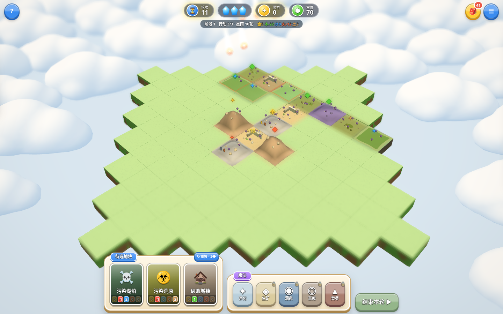
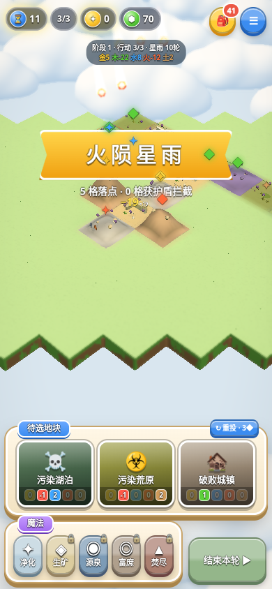
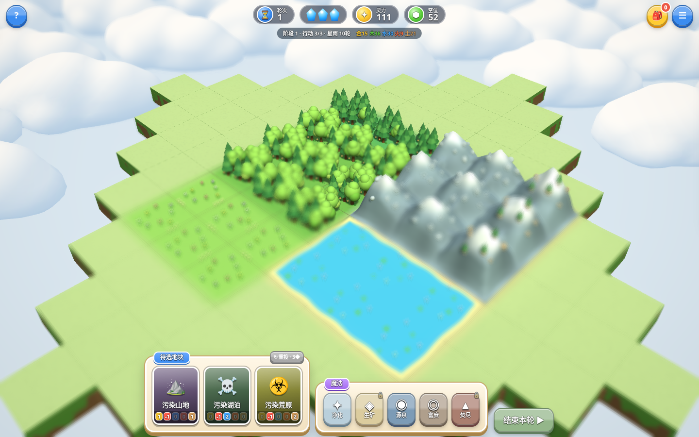
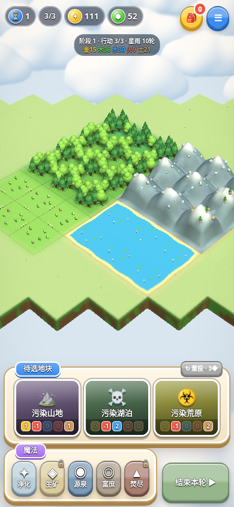

# 元素生境基线恢复

2026-10-04，用户发现正式版缺失新的魔法与火属性陨石雨。此前云端开发以 GitHub main 的《灵地复苏》代码为基线，发布时只校验线上文件与 main 一致，没有校验原有生产玩法。因此连片景观发布覆盖了较新的《元素生境》，属于基线判断错误。

## 恢复来源

已将正式域名先恢复到 Vercel 部署 `dpl_BdroLNTmciwRZ7YysJKvRhLXeKQ3`。该部署来自 CLI，记录分支 `feat/element-habitat-v1`、提交 `7b3eb1fa00d756640a8491452aebf638d7bbc1b6`，但该分支和提交不在当前公开仓库中。恢复使用 Vercel 保存的源文件及正式域名返回内容，并以部署文件 SHA-1 验证完整字节。

旧云端实现保留在 GitHub 分支 `backup/connected-landscape-before-baseline-fix`，提交 `38f2099`。恢复后的 `game.js`、`data.js`、`achievements.js`、`tokens.js`、`postfx.js`、图标与应用清单逐字节保留此前生产快照；`index.html` 和 `view.js` 仅移植连片景观、提示及表面高度适配，`landscape.js` 继续独立计算视觉区域。

| 恢复文件 | 原生产源文件 SHA-1 |
| --- | --- |
| game.js | 60e87a12bc386f525caae7b5a1586ec4815b2b20 |
| data.js | db2bba12290731c3685b9189992fcb52d3ff978e |
| achievements.js | 67a0f5aa041603c4de001f5fdd046a833222a075 |
| tokens.js | 2abe388c96c73e7fa03f16cf5d6ad166a04063e0 |
| postfx.js | 56e3bb2f6c30b6a5ff9d49c459bc79ffdc470dde |
| index.html（移植前） | db18cd8b98b217a02596c194bf9f06ebeca9bcf1 |
| view.js（移植前） | 7d2c28a4cbac3e659bd64874c08e30ece62e5ad0 |

`scripts/fixtures/element-habitat-view.js` 保存移植前的视图快照，仅规范行尾空白，函数逻辑未改动；仅供同地图比较截图使用，部署排除整个 scripts 目录。

## 必须保留的玩法

- 每轮先放置、恰好一块，初始 3 AP，进度提高至 5／7／9 AP；放置、施法各耗 1 AP。
- 对应元素全图属性达到 20 解锁魔法，解锁后保留，每种每轮一次。净化作用于目标及四邻，负属性 +5 并清除癌元；其他魔法保留 +5 属性及矿脉、泉眼、耕田、焚尽效果。
- 普通／大型／逆结晶免费、每轮不限次数；同类型四向连片增加属性上限。视觉相容区域与规则连片分别计算。
- 每 10 轮一种元素的陨石雨影响相连区域，每格 3 点对应属性伤害，元素盾抵挡。火属性对应用户提到的火雨。
- 地形升级、癌元传播、元素兽、物品、愿景、场景选择与本地成就册。

## 发布检查

先比较现有生产的来源、分支、提交和玩法，与仓库目标基线核对；检查未推送的 CLI 发布。通过规则、连片模型和实际 UI 的回归后再更新 main。发布后检查 Vercel READY、正式域名别名、源文件字节，并用正式地址复测魔法与第 10 轮火属性陨石雨。仅匹配 main 不足以说明版本正确。

执行 `npm test`、`npm run test:browser`、`npm run test:landscape`、`npm run test:gameplay`。测试仅在本地请求注入只读渲染探针；正式地址的玩法专项直接点击线上按钮，用确定性对局状态进入第 10 轮，不替换线上源码。

## 当前玩法画面

固定种子 19，按正常规则放置并结束前 9 轮，再点击第 10 轮结束按钮，复现 5 格相连区域的火属性陨石雨。下图来自实际 WebGL 画面，截图使用虚拟时钟停在陨石落地前；特效测试还验证了排队撞击执行与对象回收。

| 桌面 | 手机 |
| --- | --- |
|  |  |

连片景观采用同一张固定测试地图检查，新版 UI 和规则仍保留：

| 桌面连片模型 | 手机连片模型 |
| --- | --- |
|  |  |

## 本次修复验证

- 规则 16 项、新版玩法回归 5 项、30 局完整模拟、7200 个地表共享边界采样及模型接缝检查通过。
- 浏览器通过：交互 28 项、结晶 9 项、Bloom／景深 14 项、连片模型 26 项、新版魔法及火雨 29 项，无浏览器或 WebGL 错误。
- 85 格森林：桌面 13555 个静态实例／1627 次绘制；手机 9645 个实例／1601 次绘制。混合地图重建三次，桌面几何数 157／157／157，手机 149／149／149。
- 景深测试原冻结方法依赖旧版渲染时钟，已适配新版帧时间与特效时间。保留原图像差异阈值；没有修改生产后处理代码或跳过失败断言。

详见 [修复验证报告](current-baseline-validation.json)。软件 WebGL 和手机模拟验证功能、画面及资源回收，不代表实机帧率。

## 正式部署复测

源码修复提交 [`45659fd`](https://github.com/Pleasant233/gameplay-prototype/commit/45659fd34017fd94808e799b83af73f79e01ab21) 已更新 main 并自动部署为 `dpl_HdJmeyg6xg57A3Q9LRSsDEpxMUzZ`，状态 READY、production、git。正式域名 `https://element-habitat.vercel.app` 已指向该修复。

线上 12 个核心／许可证文件返回 HTTP 200 并逐字节匹配修复后的 main；正式地址的桌面／手机玩法专项 21 项通过，无浏览器或 WebGL 错误。该复测不替换线上源码、不注入渲染探针，直接使用线上加载的规则和按钮复现魔法与第 10 轮火属性陨石雨。

文件核对见 [正式文件报告](current-production-files.json)，实际按钮与玩法见 [正式玩法报告](current-production-gameplay.json)。后续纯文档提交可能生成新部署，公开运行源码保持一致。
