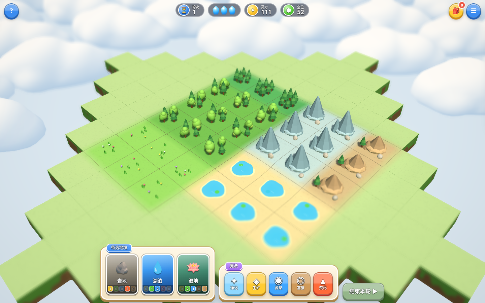
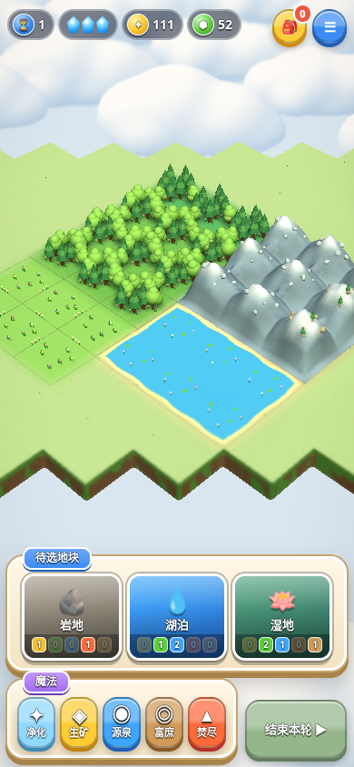

# 连片地貌与成长反馈

本次迭代把“地表连续”扩展到地貌模型。游戏仍使用当前方格地图与规则。

## 生成规则

- 相容地貌仅按四向连接；斜角接触不合并。森林／雨林、荒山／岩山、湖泊／湿地、河谷／溪原可分别合并。污染水域与清洁湖泊分开生成。
- 山脉使用全局坐标的山脊高度场，内部共享边界有山鞍，整片外围逐渐收拢。连片升级后提高山体细分、山峰高度、褶皱与碎石数量；雪线按高度着色。
- 湖岸根据地块并集的外围裁剪生成，不在内部边界重复画岸。整片水域使用同一个波动相位；溪流沿连通方向通过地块中心与共享边连接。
- 森林增加树木、分枝、地被与边界树群。草甸增加花簇，岩地和沙丘生成连片起伏，矿山和遗迹补充连接小径及碎石、柱体细节。
- 3／6／10 格是景观升阶档。各档内较大的区域继续增加总模型量，单格细节数量有上限。静态装饰使用实例化合并，手机减少密度和山体细分。

## 操作反馈

新地块落地后，成长波从连接点按路径距离扩散：邻近模型轻微伸展、地表短暂提亮、少量同主题粒子向上散开。到达升阶档或桥接两片区域时显示连片提示；升阶播放短和弦。最多同时影响桌面 24／手机 12 格，避免满图粒子风暴。

选择地块时显示连片数量与下一档。山体网格参与拾取，选择框随模型表面起伏，收益起点及景深焦点使用实际地貌高度。减少动态效果时不生成成长波或落地动画，保留文字反馈。重新开局清空成长状态及提示。

装饰模型不加入资源库存，不改变灵力、行动点、回合或生物数量。

## 验证命令

`npm test` 检查规则、共享地表以及连片拓扑、桥接、移除、重复同步、山脉／湖泊／溪流的实际模型接缝和细节增长。`npm run test:landscape` 运行浏览器检查，并生成同一地图的修改前后截图、桌面与手机成长过程及满图森林截图。原有 UI、结晶和氛围专项继续使用 `npm run test:browser`。

软件 WebGL 和手机模拟只验证功能、渲染与资源回收；实际设备的流畅度仍需实机观察。未发布到正式站点。

## 画面对比

以下为同一张固定测试地图，用于展示连片模型的变化。

| 修改前 | 修改后 |
| --- | --- |
|  |  |

## 本次云端验证

2026-10-04，Linux 云端、Chromium／SwiftShader：

- `npm test` 通过：16 项游戏规则检查、30 局完整对局模拟、7200 个共享边界采样，以及连片拓扑与模型接缝检查。
- 连片浏览器专项 26 项通过，无浏览器或 WebGL 错误；已检查桌面、手机、山体选择与成长过程截图。
- 原有浏览器回归通过：UI 28 项、结晶 9 项、氛围 14 项，均无浏览器或 WebGL 错误。
- 85 格纯森林测试图：桌面 13555 个静态模型实例、1627 次绘制；手机 9645 个实例、1601 次绘制。绘制数包含阴影和后处理，不代表帧率。
- 同一混合地图连续重建三次，桌面几何数为 158／158／158，手机为 148／148／148，没有递增。

详细检查和测量数据保存在 [本次验证报告](connected-landscape-validation.json)。浏览器截图在真实 WebGL 帧完成后暂缓绘制，以便软件 GPU 排空截图队列；此控制只注入测试请求，正式代码没有调试接口。
