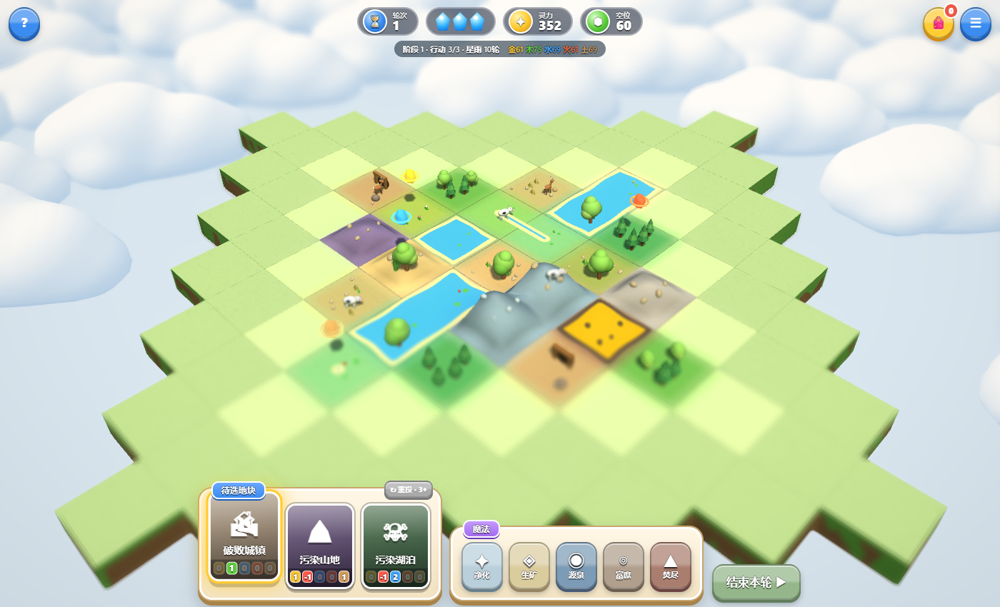
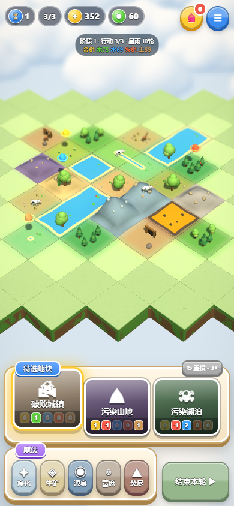
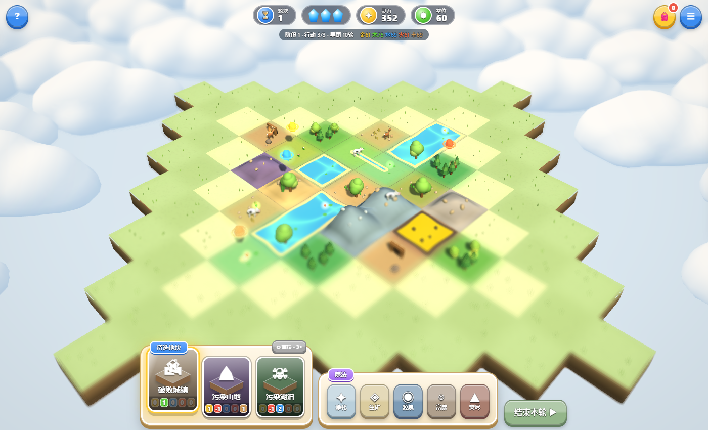
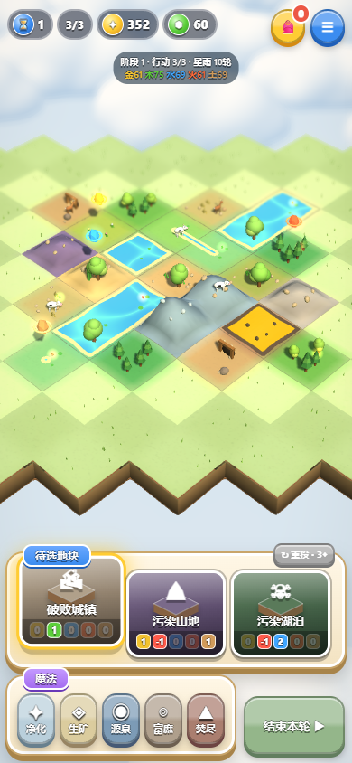

# 视觉打磨 2026-10-05

分支 `feat/visual-polish`，基于 `feat/guardian-merge`（PR #1，恢复线上守护灵）。玩法规则与 `game.js` 未改动。

## 改动

| 项目 | 内容 |
| --- | --- |
| 地块侧壁 | 草皮唇边 + 分层泥土，向底部渐暗；颜色来自地块侧壁色，空格用统一泥土色 |
| 地表着色 | 按世界坐标计算的洼地遮蔽与高处暖光，相邻地块共享同一结果，接缝不变 |
| 空地 | 棋盘交错的两种浅草色；全图一次绘制的实例化草簇，已放置格自动隐藏 |
| 光照 | 主光略低、偏暖，阴影更长；补光略增 |
| 森林 | 实例化树冠按世界坐标做明暗斑块与单株抖动，大片森林不再是一块平绿 |
| 元素灵 / 元素兽 / 癌元 | 共享加色光晕贴图（每色一份材质），亮度克制以免与 Bloom 叠加过曝 |
| 水面 | 世界坐标焦散闪光，连片湖面图案连续；减少动态效果时静止 |
| 魔法与放置 | 所有魔法加起手光斑和地面冲击波，符文与光柱更亮；落地加暖色闪光与冲击环 |
| 放置预览 | 虚影使用待选地块的颜色并轻微悬浮 |
| 待选卡 | 等距地块小图 + 选中时扫光 |
| 资源 Token | 飞向界面的结晶 / 灵力 / 空位改为带白边的光泽圆币，元素色发光；飞行逻辑不变 |
| 魔法按钮 | 未解锁时底部进度条（全图对应属性 / 20），提示文字给出数值；可施放时轻脉冲 |

## 验证

- `npm test` 通过（规则、整局模拟、地形共享边、云几何、景观、守护灵回归）。
- Edge/SwiftShader 下 `test:ui`、`test:gameplay`、`test:crystal`、`test:landscape`、`test:atmosphere` 全部通过，无 WebGL 错误；85 格森林绘制调用桌面 1628、手机 590，均在原上限内。
- 对比截图使用同一种子和局面，前为 main，后为本分支：

| | 桌面 | 手机 |
| --- | --- | --- |
| 前 |  |  |
| 后 |  |  |

软件渲染和手机模拟不能代表真机性能，也不等于最终视觉验收。
